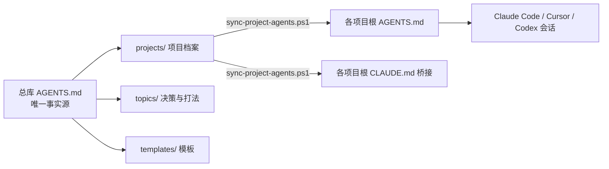

# memoryboost

> 一套**零依赖**的 AI Agent 记忆架构：让 Claude Code / Cursor / Codex / Gemini CLI 记住你的每一个项目——跨会话、跨工具、跨机器。纯 Markdown + 一条同步脚本，git 即备份。

**forge-ai 系列开源项目** · 作者：yellowgu · MIT License

## 为什么需要它

AI 编程工具的自动记忆通常按项目目录隔离：项目 A 里踩过的坑，项目 B 里的会话看不见；同一项目的两个会话各记各的。memoryboost 用三层文件架构解决：

1. **总库**（唯一事实源）：身份、偏好、铁律、项目索引——一份文件，所有项目所有会话共享
2. **项目档案**：每个项目一页纸——定位、技术栈、关键决策、踩过的坑
3. **交接单**：多会话并行时的状态交接——开始先读、结束前更新

## 架构图



## 快速开始（5 分钟）

```powershell
# 1. 克隆本仓库，或直接把 templates/ 与 scripts/ 拷进你自己的记忆库
git clone <你的仓库地址> memory
cd memory

# 2. 按 templates/AGENTS.template.md 填写你的全局记忆（身份/偏好/铁律）

# 3. 复制 templates/project.template.md 为 projects/<项目>.md 填写

# 4. 编辑 sync-map.json，声明档案到项目根目录的映射
#    {"my-project.md": "D:/code/my-project"}

# 5. 干跑验证，再正式同步
powershell -ExecutionPolicy Bypass -File scripts/sync-project-agents.ps1 -DryRun
powershell -ExecutionPolicy Bypass -File scripts/sync-project-agents.ps1
```

同步后，每个项目根得到 `AGENTS.md`（权威档案副本，Cursor/Codex/Gemini 原生读取）与 `CLAUDE.md`（一行 `@AGENTS.md` 桥接，Claude Code 经它读取）。

## 特性

| | 说明 |
|---|---|
| 零依赖 | 纯 Markdown + 一个 PowerShell 脚本，无数据库、无 MCP server、无 npm 包 |
| 跨工具 | AGENTS.md 是主流工具（Cursor/Codex/Gemini CLI/Claude Code）共同认可的标准文件 |
| git 即备份 | 记忆库就是一个 git 仓库：版本历史、跨机器同步、团队共享，天然免费 |
| 可迁移 | 换工具/换模型，拷个文件夹就走，不绑定任何厂商 |
| 方法论内置 | 附赠三角色协作制度（策划/验收/执行）+ spec 模板 + 交接单制度 |

## 竞品对比（诚实版）

| 项目 | 定位 | 与本项目差异 |
|---|---|---|
| awrshift/claude-memory-kit | Claude Code 记忆 starter kit（hooks 防腐 + 多 agent 编排） | 英文、单工具、偏重 hook/编排；本项目中文优先、跨工具、方法论模板为主 |
| reflectt/agent-memory-kit | 三层记忆 + 语义搜索 CLI | 需要 CLI 依赖；本项目坚持零依赖文件流 |
| Krimto | 跨编辑器文件型记忆（npx init） | 产品化工具；本项目是方法论 + 模板，透明可改 |
| rohitg00/agentmemory | 记忆引擎 + MCP server（向量检索） | 检索型方向；本项目是文件型，适合小团队轻量起步 |

## FAQ

**Q：和工具的自动记忆（auto memory）冲突吗？** 不冲突。自动记忆当草稿层，本架构的总库当权威层；冲突时以总库为准（规则已写进模板）。

**Q：支持 mac/Linux 吗？** 模板与方法论全平台通用；同步脚本目前是 Windows PowerShell 版，bash 版在计划中（欢迎 PR）。

**Q：怎么和团队用？** 把记忆库推到一个私有 git 仓库，队员 clone 即可；每人项目根同步自己的 AGENTS.md。

## 文章与教程

（配套教程持续更新，链接见后续 release）

## 联系

memoryboost 属于 forge-ai 开源系列。forge-ai 也承接 AI 商业应用定制开发——生意痛点 → AI 软件，几周落地。

- 邮箱：yellowgu@163.com
- 微信：17015815（请注明来意）

## 许可与作者

MIT License © 2026 forge-ai · 作者：yellowgu
