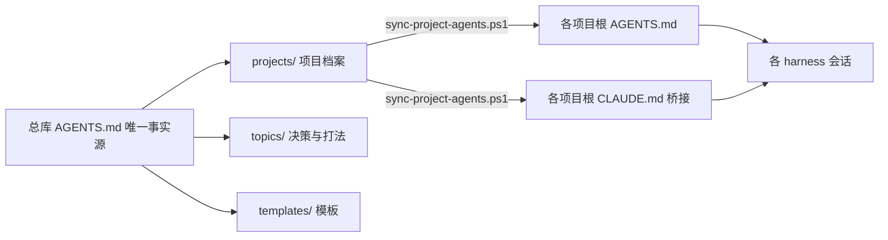

# memoryboost

> 一套**零依赖**的 AI Agent 记忆架构：让 Claude Code / Cursor / Codex / Gemini CLI 记住你的每一个项目——跨会话、跨工具、跨机器。纯 Markdown + 一条同步脚本，git 即备份。
>
> A **zero-dependency** memory architecture for AI agents — remember every project across sessions, tools, and machines. Pure Markdown + one sync script; git is your backup.

**forge-ai 系列开源项目 · forge-ai open-source series** · 作者 Author：yellowgu · MIT License

## English (brief)

memoryboost is a three-layer, file-based memory architecture for AI coding agents:

- **Global library** (single source of truth) → **project profiles** → **handoff notes**
- **Zero dependencies**: pure Markdown + one PowerShell sync script, no database, no MCP server
- **Cross-tool**: works with Claude Code, Cursor, Codex, Gemini CLI, DeepSeek Harness (dsh), TRAE CLI, CodeBuddy Code
- **Git as backup**: your memory library is just a git repo — versioned, portable, team-shareable

**Quick start**: paste the one-prompt deploy snippet (一句话部署) into your Claude Code / Cursor / dsh session — the agent builds the library and wires itself up. Or do it manually: copy `templates/` and `scripts/` into your own private memory library, fill in the templates, run `scripts/sync-project-agents.ps1`. Full step-by-step guide below (in Chinese).

**Contact**: forge-ai also builds custom AI business applications. Email: yellowgu@163.com · WeChat: 17015815 (please state your purpose)

## 为什么需要它

AI 编程工具的自动记忆通常按项目目录隔离：项目 A 里踩过的坑，项目 B 里的会话看不见；同一项目的两个会话各记各的。memoryboost 用三层文件架构解决：

1. **总库**（唯一事实源）：身份、偏好、铁律、项目索引——一份文件，所有项目所有会话共享
2. **项目档案**：每个项目一页纸——定位、技术栈、关键决策、踩过的坑
3. **交接单**：多会话并行时的状态交接——开始先读、结束前更新

## 架构图



<details>
<summary>纯文本版架构图（渲染环境不支持 mermaid 时展开查看）</summary>

```
┌─ 总库（唯一事实源 · 一个 git 仓库）────────────────────┐
│ AGENTS.md      身份 / 偏好 / 铁律 / 项目索引            │
│ projects/*.md  项目档案（每项目一页纸）                 │
│ topics/*.md    跨项目决策与可复用打法                   │
│ templates/*.md 模板（档案 / 交接单 / spec）            │
│ scripts/sync-project-agents.ps1  同步脚本              │
└───────────────────────────┬───────────────────────────┘
                            │ 按 sync-map.json 映射同步
                            ▼
              ┌──────────────────────────┐
              │ 项目根 AGENTS.md（档案副本）│
              │ 项目根 CLAUDE.md（@桥接）   │
              └────────────┬─────────────┘
                           │ 各工具原生读取
                           ▼
   Claude Code · Cursor · Codex · Gemini CLI
   DeepSeek Harness(dsh) · TRAE CLI · CodeBuddy Code
```

</details>

## 一条命令部署（最快 · 不需要任何 coding agent）

现场装、发给学员、远程装机都适用。把下面这条命令发给对方，在 PowerShell 粘贴回车——自动完成：下载模板 → 建记忆库 → 生成全局记忆 → （可选）为当前目录建档 → 首次同步。全程只问 2-3 个问题：

```powershell
irm https://gitee.com/yellowgu/memoryboost/raw/main/scripts/deploy.ps1 -OutFile deploy.ps1; .\deploy.ps1
```

- 无需安装 git（没装 git 也能用，只是少一层版本备份）
- 可重入：重跑自动跳过已完成步骤，不覆盖你已填写的档案
- 无人值守（远程装机）：`$env:MB_LIB_DIR='D:\memory'; $env:MB_USER_ID='你的代号'; .\deploy.ps1`
- 装完按屏幕提示编辑 `AGENTS.md` 补齐偏好；各工具接入方法见下节

## 一句话部署（推荐 · 让 Agent 自己装）

在 Claude Code / Cursor / Codex / DeepSeek Harness (dsh) / CodeBuddy 里**新开一个会话**，把下面对应提示词整段粘贴、回车。Agent 会问你几个问题（身份、偏好、项目背景），然后自动完成：建库 → 拷模板 → 建档 → 同步 → 接入本工具。

**交互式工具（Claude Code / Cursor / CodeBuddy Code）用这段：**

```text
请帮我部署 memoryboost 记忆架构（仓库 https://gitee.com/yellowgu/memoryboost ，按该仓库 README 操作）：
1. 建私有记忆库：mkdir D:\memory 并 git init（若该路径已存在或被占用，先问我）
2. git clone https://gitee.com/yellowgu/memoryboost D:\memoryboost-src ，把其中 templates\ 与 scripts\ 复制进 D:\memory ，再删除 D:\memoryboost-src
3. 用 templates\AGENTS.template.md 生成 D:\memory\AGENTS.md ：身份/技术偏好/协作原则/禁止事项逐项问我，未经我确认不得编造任何内容
4. 用 templates\project.template.md 为当前项目生成 projects\<项目名>.md ：定位/技术栈/关键决策逐项问我
5. 在 D:\memory 写 sync-map.json ：{ "<项目名>.md": "<当前项目绝对路径>" }
6. 运行 powershell -ExecutionPolicy Bypass -File D:\memory\scripts\sync-project-agents.ps1 -DryRun ，确认无误后去掉 -DryRun 正式运行
7. 接入本工具：Claude Code 需确认项目根 CLAUDE.md 含 @AGENTS.md 并在 %USERPROFILE%\.claude\CLAUDE.md 加一行 @D:/memory/AGENTS.md ；Cursor/Codex/Gemini/TRAE 确认项目根 AGENTS.md 已生成即可；CodeBuddy 把项目根 AGENTS.md 复制为 CODEBUDDY.md
8. 报告完成结果，并告诉我之后新会话如何验证生效
```

**一次性/无头模式（dsh `--profile headless`、Codex `-p`）用这段：**

```text
按 https://gitee.com/yellowgu/memoryboost 的 README 部署 memoryboost：在 D:\memory 建库并 git init；clone 仓库拷贝 templates\ 与 scripts\ 后删除源目录；用模板生成 AGENTS.md 与 projects\first-project.md（身份等用占位符，稍后我手工填）；写 sync-map.json 映射当前目录；运行 sync-project-agents.ps1 同步；dsh 环境再把 D:\memory\AGENTS.md 复制到 $HOME\.dsh\AGENTS.md 。全部完成后打印创建/修改的每个文件路径。
```

（无头模式没有问答，身份与偏好先用占位符生成，之后自己编辑 `D:\memory\AGENTS.md` 即可。）

**部署完怎么验证**：新开一个会话，问"当前项目的定位是什么？"能答出档案内容 = 成功。答不出 → 让 Agent 重跑第 7 步，或回退到下方手动 6 步。

## 快速开始（手动 · 6 步）

**总流程**：建记忆库 → 填全局记忆 → 建项目档案 → 跑同步脚本 → 接入你的工具 → 验证生效。

### 第 1 步：建立你自己的记忆库

你的记忆库是**私有资产**（含身份、偏好、项目内幕），必须放在你自己的私有 git 仓库，只把本仓库的 `templates/` 与 `scripts/` 拷过去：

```powershell
# 1.1 建库并初始化 git
mkdir D:\memory
cd D:\memory
git init

# 1.2 从本仓库拿模板与脚本（临时 clone 到别处，拷完即删）
git clone https://gitee.com/yellowgu/memoryboost D:\memoryboost-src
Copy-Item D:\memoryboost-src\templates,D:\memoryboost-src\scripts -Destination D:\memory -Recurse
Remove-Item D:\memoryboost-src -Recurse -Force
```

> 只想快速体验？直接 clone 本仓库，跳过第 1-2 步，用 `examples/sync-map.json` 跑第 4 步即可（`demo-shop.md` 是虚构示例项目）。

### 第 2 步：填全局记忆 AGENTS.md

```powershell
Copy-Item templates\AGENTS.template.md AGENTS.md
# 打开 AGENTS.md 填写：身份 / 技术偏好 / 协作原则 / 禁止事项 / 项目索引
```

### 第 3 步：建项目档案 + 声明映射

```powershell
Copy-Item templates\project.template.md projects\<项目名>.md
# 填写档案后，在记忆库根目录新建 sync-map.json：
# { "<项目名>.md": "D:/code/<你的项目目录>" }
```

### 第 4 步：跑同步脚本

```powershell
# 先干跑看效果，再正式同步
powershell -ExecutionPolicy Bypass -File scripts\sync-project-agents.ps1 -DryRun
powershell -ExecutionPolicy Bypass -File scripts\sync-project-agents.ps1
```

同步后每个项目根得到 `AGENTS.md`（档案副本）与 `CLAUDE.md`（一行 `@AGENTS.md` 桥接；已存在的 CLAUDE.md 绝不覆盖）。

### 第 5 步：接入你的 Coding Agent

| 工具 | 需要你做的事 |
|---|---|
| **Claude Code** | ① 项目根 `CLAUDE.md` 已由第 4 步生成，自动生效；② 全局记忆：在 `%USERPROFILE%\.claude\CLAUDE.md`（无此文件则新建）加一行 `@D:/memory/AGENTS.md` |
| **Cursor / Codex / Gemini CLI / TRAE CLI** | 无需操作——项目根 `AGENTS.md` 原生自动读取 |
| **DeepSeek Harness (dsh)** | 把总库入口复制到用户目录：`Copy-Item D:\memory\AGENTS.md $HOME\.dsh\AGENTS.md` |
| **CodeBuddy Code** | 官方主推 CODEBUDDY.md：在项目根执行 `Copy-Item AGENTS.md CODEBUDDY.md` |

### 第 6 步：验证生效

在对应工具**新开一个会话**，问：

```
这个项目的定位是什么？最近的关键决策有哪些？
```

能答出档案内容 = 部署成功。答不出 → 检查第 5 步的文件位置与内容，再新开会话重试（已开的会话不会重新加载）。

### 日常维护（每次 30 秒）

- 档案更新后重跑一次同步脚本；新项目建档 = 复制模板 → `sync-map.json` 加一行 → 重跑
- 多会话协作：项目根 `HANDOFF.md` 开始先读、结束前更新（模板：`templates/HANDOFF.template.md`）
- 想进一步定制（spec 流程、三角色协作制度）→ 见 [docs/architecture.md](docs/architecture.md)

## 特性

| | 说明 |
|---|---|
| 零依赖 | 纯 Markdown + 一个 PowerShell 脚本，无数据库、无 MCP server、无 npm 包 |
| 跨工具 | AGENTS.md 是主流 harness（Claude Code/Cursor/Codex/Gemini CLI/DeepSeek Harness/TRAE CLI 等）共同认可的标准文件，见下方支持表 |
| git 即备份 | 记忆库就是一个 git 仓库：版本历史、跨机器同步、团队共享，天然免费 |
| 可迁移 | 换工具/换模型，拷个文件夹就走，不绑定任何厂商 |
| 方法论内置 | 附赠三角色协作制度（策划/验收/执行）+ spec 模板 + 交接单制度 |

## 支持的 Harness（2026-08 验证）

| Harness | AGENTS.md 支持 | 说明 |
|---|---|---|
| Claude Code | ✅ 原生（经 CLAUDE.md `@` 桥接） | 本项目原生设计目标 |
| Cursor / Codex / Gemini CLI | ✅ 原生 | AGENTS.md 为标准共识文件 |
| DeepSeek Harness（dsh） | ✅ 原生 | DeepSeek 官方 harness；`~/.dsh/AGENTS.md` 全局 + 项目链 |
| TRAE CLI（字节/豆包） | ✅ 原生 | 当前及上级目录恒载，支持 `@file.md` 引用；中文版历史版本需确认开关 |
| CodeBuddy Code（腾讯 WorkBuddy） | ⚠️ 兼容 | 官方主推 CODEBUDDY.md，AGENTS.md 仅在项目无 CODEBUDDY.md 时生效；可将项目根 AGENTS.md 另存为 CODEBUDDY.md 使用（同步脚本后续版本计划支持输出，欢迎 PR） |

## 竞品对比（诚实版）

| 项目 | 定位 | 与本项目差异 |
|---|---|---|
| awrshift/claude-memory-kit | Claude Code 记忆 starter kit（hooks 防腐 + 多 agent 编排） | 英文、单工具、偏重 hook/编排；本项目中文优先、跨工具、方法论模板为主 |
| reflectt/agent-memory-kit | 三层记忆 + 语义搜索 CLI | 需要 CLI 依赖；本项目坚持零依赖文件流 |
| Krimto | 跨编辑器文件型记忆（npx init） | 产品化工具；本项目是方法论 + 模板，透明可改 |
| rohitg00/agentmemory | 记忆引擎 + MCP server（向量检索） | 检索型方向；本项目是文件型，适合小团队轻量起步 |

## FAQ

**Q：和工具的自动记忆（auto memory）冲突吗？** 不冲突。自动记忆当草稿层，本架构的总库当权威层；冲突时以总库为准（规则已写进模板）。

**Q：支持 mac/Linux 吗？** 模板与方法论全平台通用；同步脚本目前是 Windows PowerShell 版，bash 版在计划中（欢迎 PR）。

**Q：怎么和团队用？** 把记忆库推到一个私有 git 仓库，队员 clone 即可；每人项目根同步自己的 AGENTS.md。

## 文章与教程

（配套教程持续更新，链接见后续 release）

## 联系

memoryboost 属于 forge-ai 开源系列。forge-ai 也承接 AI 商业应用定制开发——生意痛点 → AI 软件，几周落地。

- 邮箱：yellowgu@163.com
- 微信：17015815（请注明来意）

## 许可与作者

MIT License © 2026 forge-ai · 作者：yellowgu
